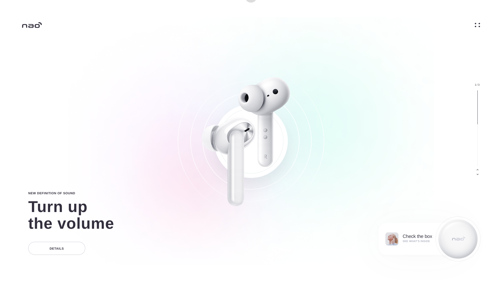

<h1 align="center">
  Twitch Live 12: Airpods
</h1>

  
  
  
  
  

  
  
  

  

## 💻 Projeto

Esse projeto foi desenvolvido durante uma _livecoding_ na [Twitch.tv](https://www.twitch.tv/leovargasdev).
O protótipo desse website foi desenvolvido pelo studio [**Subtl**](https://dribbble.com/subtl), [clique aqui](https://www.figma.com/file/wwRTCuN8KFmY8HVQRD4Zjv/live-code?node-id=2%3A2) para abrir o protótipo no figma.

### Dependências

-  HTML
-  CSS
